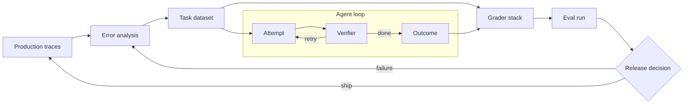

# Research Dossier: Measure Twice, Prompt Once

**Status:** Working research dossier, not reader-facing manuscript  
**Compiled:** 2026-08-24  
**Purpose:** Preserve the evidence, case-study plan, statistical examples, organizational practices, and publication cautions for a practical book on designing and operating AI evaluations.

This dossier supports the manuscript in [`../book/`](../book/). The manuscript should be warm, direct, vendor-neutral, and readable. This file is allowed to be fussy. Its job is to remember which benchmark version was used, where a number came from, what can safely be reproduced, and which claim needs another fact-check before publication.

The complete, maintainable source registry lives in [`../book/codex.md`](../book/codex.md). Source IDs in this dossier and the manuscript point there. The dedicated comparison of public worked examples lives in [`worked-eval-examples-comparison.md`](worked-eval-examples-comparison.md).

Because none of the reviewed public cases exposes the entire chain, [`../book/appendix-complete-fictional-loop.md`](../book/appendix-complete-fictional-loop.md) and [`../examples/parcelpath/`](../examples/parcelpath/) provide a clearly labeled fictional case with runnable artifacts. Its simulated counts illustrate method and support no external empirical claim.

---

## 1. Book thesis and market shape

### Working title

**Measure Twice, Prompt Once**  
*Building Evals for AI Agents That Work in Production*

The book's central claim is simple:

> An AI product does not improve because the team has a better prompt. It improves because the team can repeatedly observe real failures, turn them into durable evaluation cases, grade them credibly, make a change, and learn whether the change helped.

That process is the **outer eval loop**. It wraps the agent's **inner execution loop**:

- The inner loop attempts, observes, verifies, retries, stops, or escalates.
- The outer loop samples outcomes, analyzes errors, updates tasks and graders, compares variants, and changes the system.
- The seam between them is made of task contracts, graders, traces, and telemetry.

Most teams have pieces of this. Few have a loop. A dashboard is not a loop. A benchmark run is not a loop. A red-team exercise performed once during a launch week—usually while everyone is eating pizza and making decisions they will later describe as "context dependent"—is not a loop.

### Why there is enough material for a roughly 200-page book

The repository contained about 171,400 words of Markdown when scoped for this project: roughly 99,859 words in articles and 71,541 in core documents. Approximately 35,000 words directly concerned evals, verification, monitoring, failure recovery, and loop engineering. The most relevant starting points were:

| Existing source | Approximate words |
|---|---:|
| `evals.md` | 4,330 |
| `codex-loops.md` | 8,462 |
| `framework.md` | 5,583 |
| `article-verification-functions.md` | 2,368 |
| `article-agentic-loops-in-the-wild.md` | 2,574 |
| `article-loop-health-monitoring.md` | 1,910 |
| `article-failure-recovery-agent-loops.md` | 2,200 |
| `article-multi-agent-loops.md` | 2,204 |
| `article-loop-engineering-doctrine.md` | 2,462 |
| `article-evaluation-driven-development.md` | 1,691 |
| `article-two-loops.md` | 1,097 |

The successful sibling title in `../ai-augmented-dev/main-book/` demonstrates that a manuscript near 40,000 words can render to approximately 200–250 pages in a 6×9 KDP layout once front matter, part openers, diagrams, exercises, references, and back matter are included. This book therefore targets roughly 40,000–45,000 manuscript words rather than padding toward an arbitrary word count.

### Recommended page budget

| Section | Purpose | Target pages |
|---|---|---:|
| Introduction | Why demos lie and why products need eval loops | 8 |
| Part I: Discover | Error analysis, failure taxonomies, task datasets | 42 |
| Part II: Measure | Grader stacks, judges, traces, and statistics | 62 |
| Part III: Operate | CI gates, production sampling, drift, benchmark failure | 52 |
| Part IV: Build | Ownership, cadence, and a 30-day implementation plan | 26 |
| Appendixes | Exercises, templates, glossary, source notes | 10+ |

The sibling book's practical lesson is to treat page count as a build output, not a prose target. At final production time, rebuild the KDP interior, inspect the page count, and regenerate the cover wrap because its spine width depends on that count.

---

## 2. Narrative spine

The book should not read like fifteen articles that met for the first time in a binding. It follows one question as the reader earns increasingly sophisticated answers:

1. What does “good” mean for this product?
2. Which real failures reveal that definition?
3. How do we turn failures into replayable tasks?
4. What is the strongest credible grader for each task?
5. How do we test whether the grader deserves trust?
6. Does the whole agent succeed consistently, not merely once?
7. Do offline results predict production outcomes?
8. Who owns this truth after launch?

Four sustained published case studies provide four kinds of truth:

| Case | Primary truth source | Persistent question |
|---|---|---|
| SWE-bench | Executable tests and repository state | What if the test is precise but wrong? |
| τ-bench / τ³-bench | Environment and database state | Did the promised action actually happen? |
| HealthBench | Case-specific expert judgment | Who gets to define good? |
| DeepResearch Bench | Claims, sources, and evidence | Is a polished answer actually supported? |

Each conceptual chapter should revisit at least two cases. The reader sees task design, grader design, trace analysis, statistics, release decisions, and maintenance through the same four lenses. A small fictional composite product team may connect the chapters, but fictional behavior must never be presented as evidence. The published cases remain the evidence.

---

## 3. Sustained case study A: SWE-bench

### The story

SWE-bench turns real GitHub issues into coding tasks. An agent receives a repository and issue, produces a patch, and is graded by tests. This appears to be the cleanest possible eval: the code either passes or it does not. Its history is useful precisely because the clean answer became complicated.

The original benchmark collected 2,294 real issues from twelve Python repositories [SWE-01]. For SWE-bench Verified, 1,699 candidate instances were screened by 93 Python developers, with three independent reviews per instance. Five hundred were retained; 68.3 percent of candidates were filtered because of underspecification, unfair tests, or related issues [SWE-02] [SWE-06]. The project released the annotation rubric and a containerized harness [SWE-04] [SWE-05].

Later, OpenAI audited 138 tasks that o3 frequently failed across 64 runs. It reported material task or test issues in at least 59.4 percent of the audited set: 35.5 percent with tests that were too narrow, 18.8 percent too broad, and 5.1 percent with miscellaneous problems. It also reported evidence consistent with contamination or exposure to gold patches across all frontier models it tested. OpenAI stopped reporting SWE-bench Verified and recommended harder successors such as SWE-bench Pro [SWE-03].

### Why it belongs throughout the book

SWE-bench makes five lessons concrete:

1. An executable oracle can be deterministic and still encode the wrong contract.
2. Hidden tests can enforce implementation details the prompt never stated.
3. A benchmark has a lifecycle: creation, curation, use, saturation, contamination, retirement.
4. A good eval needs its own eval: annotation review, harness validation, and disagreement analysis.
5. Version is part of the result. “We scored 72” is incomplete without the split, harness, model settings, attempts, and date.

### Material available for adaptation

- Original paper and task design [SWE-01]
- Verification study and reported screening process [SWE-02]
- Public annotation instructions [SWE-06]
- Docker evaluation harness [SWE-04]
- MIT-licensed repository [SWE-05]
- Retirement audit and contamination discussion [SWE-03]
- Public SWE-agent trajectories may support annotated trace examples, subject to a separate license review [SWE-07]

### Publication cautions

- Do not imply that the 138-task audit estimates the defect rate of all 500 Verified tasks; it was a targeted sample of tasks frequently failed by o3.
- Freeze the benchmark version whenever reporting a result.
- Reproduce only material allowed by the relevant repository and source licenses.
- Label SWE-bench Verified as a historically important, now-questioned benchmark rather than current ground truth.

---

## 4. Sustained case study B: τ-bench and τ³-bench

### The story

Customer-service agents are excellent at saying a task is complete. Databases are less sentimental.

τ-bench evaluates tool-using agents that must follow domain policy while interacting with a simulated user and changing an environment. The original work covered retail and airline tasks and emphasized end-state database comparison and interaction-level reliability [TAU-01]. The maintained repository, still named `tau2-bench` while branded τ³-bench, expands the domains and evaluator architecture [TAU-02].

The grader separates several concerns:

- the final database or environment state;
- required or prohibited actions;
- facts the agent communicated to the user;
- natural-language assertions that require judgment.

The public evaluator code makes that composition inspectable [TAU-03]. The CLI supports trajectory review and re-grading, allowing a team to ask not just whether a run failed but where it departed from the policy or desired state [TAU-04].

The original study reported frontier function-calling agents succeeding on fewer than half of tasks. It introduced **pass^k**, the chance an agent succeeds on all of k attempts. In retail, reported pass^8 was below 25 percent, revealing a reliability problem hidden by occasional success [TAU-01]. The current benchmark has received extensive task fixes; new analysis should use the maintained base split, not casually compare current results with the original release.

### Why it belongs throughout the book

τ-bench makes the difference between a claim and an outcome impossible to ignore:

- “Your flight is changed” is text.
- A reservation record with the right flight, fee, passenger, and authorization is state.

It also exposes conflicts between dimensions. An agent can achieve the requested end state while violating policy. It can obey policy but fail to help. It can make the right tool call and tell the user the wrong thing. A single score hides these distinctions; a grader stack preserves them.

### Material available for adaptation

- Published task and reliability design [TAU-01]
- Maintained benchmark implementation and domains [TAU-02]
- Concrete composite evaluator implementation [TAU-03]
- Trajectory inspection and re-grading workflow [TAU-04]

### Publication cautions

- Use the current split and identify the version or commit.
- Treat original and maintained benchmark results as related but not interchangeable.
- If reproducing a trajectory, confirm that the specific generated output and user simulation may be republished, then redact incidental personal data even when synthetic.

---

## 5. Sustained case study C: HealthBench

### The story

HealthBench starts where generic helpfulness rubrics stop. It contains 5,000 realistic health conversations and 48,562 case-specific rubric criteria, developed with 262 physicians across 60 countries [HEALTH-01] [HEALTH-02]. The conversations are multi-turn and multilingual and include synthetic and human-adversarial cases. Each case has criteria with point values. An automated grader evaluates each criterion, producing a score that can be decomposed rather than a single impressionistic thumbs-up.

The project also released a meta-evaluation that compares automated grading with physician opinions and breaks performance down by category and physician agreement [HEALTH-04]. Variants such as HealthBench Consensus and HealthBench Hard make agreement and difficulty explicit rather than pretending every case has an obvious answer.

### Why it belongs throughout the book

HealthBench demonstrates that “good” is often case-specific. A generic rubric such as “accurate, helpful, and safe” is too broad to tell a team what failed. A useful rubric might say that the answer must recognize a particular red flag, avoid a dangerous recommendation, ask one missing question, and communicate the urgency without causing needless panic.

It also provides the book's clearest answer to “Who validates the validator?” A model judge can reduce review cost, but it must be measured against expert labels, with disagreement inspected by failure type. Judge agreement is evidence, not absolution.

### Publication cautions

The dataset is available under MIT terms, but its maintainers explicitly ask people not to reproduce prompts or examples in plain text or images because doing so can contaminate future model training and evaluation [HEALTH-03]. The book should honor that request:

- explain the method and schema;
- create original analogous examples;
- do not reproduce benchmark questions, answers, or rubric text;
- link readers to the official source rather than making a shadow copy.

This is a useful ethical example in its own right: legal permission is not the same as responsible publication.

---

## 6. Sustained case study D: DeepResearch Bench

### The story

Deep-research agents can produce reports that look as though they have spent a pleasant semester in a library. The bibliography is long. The headings are confident. The evidence may still be held together with decorative string.

DeepResearch Bench contains 100 PhD-level tasks across 22 fields, balanced using analysis of 96,147 real user queries. Its public data includes 400 complete reports from four systems and 150 expert RACE annotations. More than 70 master's-level or domain-expert annotators participated, with three annotators per task in its human-consistency study [DRB-01]. The dataset is published under Apache 2.0 [DRB-02], and evaluation code is public [DRB-03].

The benchmark separates two broad questions:

- **RACE** evaluates report quality: comprehensiveness, depth, instruction following, and readability.
- **FACT** evaluates citation accuracy and effective citation count.

The separation matters. A report can be lucid but unsupported, heavily cited but shallow, accurate on cited claims but incomplete, or comprehensive and unreadable. The aggregate score is useful for ranking; the profile is useful for engineering.

### Why it belongs throughout the book

This case provides the bridge from output grading to evidence grading. It supports chapters on trace annotation, model judges, dimensional scorecards, retrieval evaluation, and production monitoring. It also illustrates why the strongest grader often checks an artifact outside the model's prose: source resolution, quote support, citation entailment, and coverage.

### Publication cautions

The dataset's Apache license does not automatically grant rights to every third-party work cited inside a generated report. Use original or small derived examples, keep quotations brief, and review individual source rights before reproducing a report, annotation, or screenshot.

---

## 7. Advanced sidebars

### PaperBench

PaperBench evaluates agents attempting to reproduce 20 ICML 2024 papers. It contains 8,316 hierarchical criteria co-developed with paper authors. Agents produce a codebase and reproduction script. A separate JudgeEval assesses the automated judge; the best reported judge reached F1 0.83. Claude 3.5 Sonnet reportedly achieved 21.0 percent, while human ML PhDs reached 41.4 percent best-of-three after 48 hours on the comparable subset, versus 26.6 percent for o1 [PAPER-01].

Use it to show hierarchical rubrics, long-horizon artifacts, judge evaluation, and the importance of time budgets.

### RE-Bench

RE-Bench contains seven machine-learning research environments and data from 71 eight-hour attempts by 61 experts. It releases environments, human data, analysis, and agent trajectories. Agents were reported at roughly four times human performance at a two-hour budget, while humans overtook them with longer budgets; around 32 hours humans achieved about twice the score of the best AI system [REBENCH-01].

Use it for score@k, best-of-many comparisons, time allocation, bootstrap intervals, and the reminder that budget is part of the task definition.

### BrowseComp

BrowseComp contains 1,266 difficult web-research questions and is useful for discussing search persistence and contamination. Its maintainers explicitly request that examples not be revealed [BROWSE-01]. Mention the design; do not reproduce protected cases.

### AgentLens

AgentLens, published in 2026, reports 1,815 software-engineering agent trajectories annotated for quality, waste, and divergence [AGENTLENS-01]. It may become a useful source for the trace chapter, but licensing and stable dataset access need verification before it is used beyond a short methodological mention.

### ACES / SkillEvaluator

Kevin et al.'s ACES study treats an agent skill, plugin, or capability package as the intervention rather than grading only the agent. It pairs live runs with and without the target while holding task, model, harness, workspace support, and scorer fixed; normalizes trajectories into ATIF; and reports the paired delta as Skill Lift [ACES-01]. The public NVIDIA SkillEvaluator repository implements static validation, deduplication, dataset creation, and live evaluation as independently invocable tiers [ACES-02].

The study covers 145 real skills. Across 947 scored paired cases, it reports mean composite lift of 0.2134 with a 95 percent paired-case interval of 0.1967–0.2301; 87 paired cases had negative composite lift. Static structural and model-judge document scores had near-zero rank correlation with live lift on the matching subset. Use this as evidence that artifact quality and runtime contribution answer different questions—not as a universal estimate of skill value. The authors note uneven harness coverage, corpus skew toward enterprise infrastructure, environment dependence, and unmeasured live inter-judge agreement.

---

## 8. Statistical examples to carry through the manuscript

The book needs concrete arithmetic because “the score went up” is not a release argument.

### Example 1: a proportion and its uncertainty

An agent passes 43 of 50 cases: 86 percent. The approximate Wilson 95 percent confidence interval is 73.8–93.0 percent. The point estimate is encouraging, but the data do not establish that the true pass rate is safely above an 85 percent release floor [STAT-01] [STAT-02].

Use this to teach:

- why a point estimate is not a guarantee;
- why a small suite can be directional but not decisive;
- why release rules should be written before looking at the result.

### Example 2: pass@k and pass^k

If one attempt succeeds with probability 0.75 and attempts are treated as independent:

- `pass@3 = 1 - (1 - .75)^3 = 98.44%`: at least one of three attempts succeeds.
- `pass^3 = .75^3 = 42.19%`: all three attempts succeed.

The first is useful when you can sample and select. The second resembles the user's experience when the system must work repeatedly. A demo can be nearly certain while a three-use workflow is worse than a coin flip.

### Example 3: paired comparison

Two variants run on the same 100 cases. The new system alone passes 18; the old system alone passes 8; both agree on the remaining 74. The observed improvement is ten percentage points. An exact two-sided McNemar/binomial test on the 26 discordant pairs gives approximately `p = 0.0755` [STAT-03]. That is promising evidence, not a conventional five-percent-threshold conclusion.

Use this to show why paired evaluation is stronger than comparing two independent aggregate percentages.

### Example 4: clustered data

Fifty questions drawn from five documents are not necessarily fifty independent observations. Failures may be caused by document structure, customer account, conversation, or domain. Cluster at the level that generates shared error. Anthropic reported cases where cluster-aware standard errors were more than three times naive estimates [STAT-01].

### Example 5: judge confusion matrix

Use an explicitly synthetic 100-case judge-calibration set:

| | Expert says pass | Expert says fail |
|---|---:|---:|
| Judge says pass | 36 | 5 |
| Judge says fail | 10 | 49 |

Ask the reader to calculate pass precision, pass recall, false-pass rate, false-fail rate, and whether the threshold suits the decision. The five false passes may matter more than the ten false fails when the grader gates a high-risk release.

### Example 6: time budget changes the ranking

Use RE-Bench to compare many short attempts with fewer long attempts. State model calls, wall time, retries, and selection policy. A leaderboard without a budget is a restaurant menu without prices: interesting, but not yet a plan.

### Example 7: paired component lift

Use ACES to show a matched intervention study: `0.7460` mean with-skill composite score versus `0.5326` baseline across 947 paired task cases, for a mean delta of `0.2134` and a 95 percent paired-case interval of `0.1967–0.2301` [ACES-01]. Then inspect the 87 negative-lift pairs rather than letting the positive mean end the conversation. State that the effect is conditional on the declared workspace, model, harness, task, and baseline policy.

---

## 9. Organizational case material

### Cross-check against public worked examples

Four sources sharpen the human-first workflow rather than merely repeating it:

- A direct comparison on 100 apartment-leasing traces found that automated systems recovered many human-labeled failures and discovered additional valid problems, while consistently missing product rules absent from the trace [AUTO-01].
- A Langfuse walkthrough shows why the annotation unit must be chosen explicitly and why human reviewers still need to split model-made clusters when the underlying behaviors imply different fixes [WORKED-01].
- A CHI 2026 study found overlapping but distinct codes from domain experts and an NLP developer, then showed that a structured second pass could reveal additional overlooked issues [EXPERT-01].
- TRAIL reports much lower performance when the job is joint error categorization and exact localization inside longer agent traces [TRACE-01].

Together they rule out a single sweeping answer to “Can AI do error analysis?” The answer depends on the artifact under review, the context supplied, the label space, and whether success means finding a suspicious trace or locating the first bad span. Full comparison, caveats, and source gaps are recorded in the worked-example review.

### Anthropic's operating guidance

Anthropic describes dedicated evaluation teams owning infrastructure while domain and product teams contribute tasks, run evals, and interpret failures. Its guidance suggests 20–50 cases as a practical starting point and combines weekly transcript review, periodic human calibration, pre-launch or CI evaluation, production monitoring, A/B tests, and user feedback [ANTH-01].

Published examples in that guidance include:

- Descript separating “do not break things,” “do what was asked,” and “do it well,” with quality and regression suites serving different purposes.
- Bolt reportedly building an evaluation system over roughly three months with static analysis, browser agents, and model judges.

### LinkedIn

LinkedIn has described a central horizontal team owning evaluation, testing, and global prompt templates while vertical product teams own their agents. Linguists reportedly reviewed up to 500 conversations per day; engineering signals arrived quickly, annotations roughly a day later, and product or member outcomes later still [ORG-01].

For search evaluation, LinkedIn described product managers acting as a final adjudication layer, gold-label creation after weighted Cohen's kappa reached at least 0.8, and model judges grading very large query-document volumes with a distilled 8B model and continuous stratified workflows [ORG-02].

### Nova Escola

Hamel Husain's production-evals case study describes a product serving roughly one million monthly users and 200,000 teachers. Early rubric-first work wasted labeling effort; two annotators agreed less often than chance until pedagogical experts rewrote the rubric. The team later ran daily evaluations on a two-percent sample of production traffic [ORG-03].

This is a strong recurring example of criteria drift: people often discover what “good” means by trying to grade actual outputs.

### Spotify

Spotify's experimentation guidance argues that evals verify a change while online experiments validate impact. A/B tests calibrate the offline proxy against user outcomes. Spotify reports that only about 12 percent of A/B tests ship a positive result, 64 percent produce valid learning, and 42 percent of launched experiments were rolled back because of regressions in secondary metrics [ORG-04].

### Uber

Uber describes moving prompts into production only after they cross a threshold on an evaluation dataset, then monitoring them on production data [ORG-05]. Use this as a compact example of a prompt lifecycle rather than a tooling recommendation.

### NVIDIA ACES

ACES offers a concrete ownership and cadence split for reusable agent capabilities: authors own evaluation intent, cases, expected behaviors, and optional domain tasks or graders; the evaluation layer stages paired environments, normalizes traces, and reports marginal contribution across harnesses [ACES-01]. Its recommended cost shape is static scanning on each change and live paired trials for release candidates, high-risk capabilities, or reviewer-requested changes. Model updates trigger scheduled re-evaluation because a stronger baseline can shrink measured lift even while absolute quality rises.

---

## 10. Ownership and cadence model

### Clear ownership

| Role | Owns |
|---|---|
| Central eval platform | Harness, isolation, versioning, storage, access, observability, CI integration, cost controls |
| Product or domain owner | Meaning of good, priority cases, rubric intent, release thresholds |
| Domain experts | Gold labels, ambiguity resolution, judge calibration, consequential exceptions |
| Engineering team | Task contracts, deterministic graders, fixes, regression cases |
| Statistics or data science | Sampling, uncertainty, power, clustering, drift analysis |
| Safety, risk, or compliance | Hard must-not-pass criteria, held-out audits, approval boundaries |
| Named decision owner | Ship/no-ship decision and acceptance of residual risk |

The RACI is less important than a name. “The AI team owns evals” is an org-chart-shaped way of saying nobody will update the rubric on Friday afternoon.

### Operating cadence

| Trigger or cadence | Practice |
|---|---|
| Every pull request | Deterministic smoke tests and a small regression subset |
| Nightly | Full suite, repeated trials, cost and latency reporting |
| Weekly | Read sampled production traces; add representative failures |
| Monthly | Recalibrate judges; review coverage, saturation, stale cases, and ownership |
| Quarterly or major model change | Held-out audit, adversarial test, power review, dataset refresh |
| Incident | Add a permanent regression case as part of the response |
| Prompt, model, tool, retrieval, or harness change | Re-run the layers the change can invalidate |

---

## 11. Exercise plan

1. **Read twenty traces.** Annotate failures with open notes, then induce a taxonomy.
2. **Write five task contracts.** Convert failures into setup, input, expected state, and evidence.
3. **Build the grader without an LLM first.** Identify state, schema, executable, and evidence checks.
4. **Hack the grader.** Find three outputs that pass while violating the real intent.
5. **Calibrate a judge.** Label a shared sample, calculate false-pass and false-fail rates, revise the rubric.
6. **Compare pass@k and pass^k.** Choose the metric that matches the user workflow.
7. **Write the release rule first.** Include minimum effect, uncertainty, cost, latency, and must-not-regress dimensions.
8. **Design production sampling.** Specify units, strata, privacy controls, rates, and audit ownership.
9. **Run a paired comparison.** Record discordant cases and inspect them before reading the p-value.
10. **Assign ownership.** Put a real name and recurring meeting beside every eval artifact.
11. **Run hacker and fixer roles.** One group exploits the grader; another repairs it without overfitting.
12. **Retire a suite.** Detect saturation, leakage, or product drift and write a deprecation plan.

---

## 12. Template plan

The practical appendix should include copyable forms for:

- evaluation objective and decision record;
- task-case schema;
- trace annotation sheet;
- failure-taxonomy register;
- grader specification;
- model-judge calibration report;
- eval run comparison report;
- release decision;
- production sampling plan;
- eval-suite health review;
- ownership/RACI map;
- dataset provenance and rights card;
- benchmark version and deprecation log.

Each template should answer four questions: What decision does this support? Who owns it? What evidence fills it? When is it reviewed again?

---

## 13. Diagram candidates

The final visual brief belongs in `book/visual-brief.md`, but the research implies at least these technical diagrams:

1. Nested agent and eval loops.
2. The grader ladder: environment oracle → executable test → evidence check → rule → model judge → expert.
3. Task anatomy: setup → prompt → trace → end state → grader evidence.
4. Judge calibration: expert labels → confusion matrix → threshold → audit queue.
5. Eval funnel: local smoke → nightly suite → held-out audit → production experiment.
6. Dataset lifecycle: production failure → capability case → regression case → saturation → refresh or retirement.
7. Ownership map across platform, product, engineering, experts, statistics, and risk.
8. Swiss-cheese evidence layers: automated eval, monitoring, A/B test, user feedback, transcript review, systematic expert study.

A useful first sketch of the nested loops:

---

## 14. Rights, provenance, and contamination checklist

For every dataset, trace, screenshot, diagram adaptation, or quoted passage:

1. Record source URL, version or commit, access date, and license.
2. Distinguish quoting a method from reproducing a dataset example.
3. Never publish protected or hidden benchmark answers, canary items, or gold patches.
4. Honor anti-leak requests for HealthBench and BrowseComp even where code or data licenses are permissive.
5. Prefer newly authored analogous examples and schematic traces.
6. Keep quotations brief and clearly attributed.
7. Review screenshot and logo rights independently of text rights.
8. Freeze the benchmark version attached to every numerical claim.
9. Present retired benchmarks historically, not as current truth.
10. Verify third-party source rights embedded inside generated reports.

---

## 15. Drafting principles inherited from the publishing baseline

The sibling book that serves as the production baseline uses:

- Markdown as the manuscript source of truth;
- one file per chapter;
- four named parts with divider pages;
- a short preface, a direct opening problem, evidence chapters, a central framework, and an implementation playbook;
- 6×9 print trim through Typst;
- a separate KDP interior theme with safe gutters and no digital cover pages;
- EPUB export from the same Markdown sources;
- front matter, table of contents, glossary, references, and author page;
- source SVG diagrams, not screenshots, for print clarity;
- a build validation step before PDF compilation;
- a reminder to regenerate the paperback cover whenever page count changes.

This manuscript should follow those conventions while improving reference maintenance through a dedicated `book/codex.md` file. Reader-facing `references.md` can be generated or curated from the codex later; the codex remains the exhaustive source of truth.

---

## 16. Decisions still open before final publication

- Final title and subtitle.
- Whether the author presents LoopRails as the named framework or keeps the book fully generic.
- Author biography and acknowledgments.
- Edition date, ISBNs, and publisher line.
- Whether exercises remain in print or move partly to a downloadable toolkit.
- Which benchmark traces receive explicit reproduction permission.
- Final illustrations and cover system.
- Whether the codex appears in print, online only, or both. Recommended: a concise print references section plus a complete maintained online codex.

---

## 17. Practitioner sequence: frontier models, harnesses, and tuned open weights

Five Jebra posts published from June through August 2026 form a useful, if incompletely reported, case sequence for structured payroll extraction [EXTRACT-01] [EXTRACT-02] [EXTRACT-03] [EXTRACT-04] [EXTRACT-05]. Their value is cumulative. They begin with input wording, add complexity slices and quantization, separate grammar from documentation, then fine-tune a small open-weight model and compare it with a frontier API.

| Source | Book value | Claim boundary |
|---|---|---|
| Write for the machine | Strong example of controlling upstream language and measuring fields under constrained JSON | One repeated agreement pattern, one small model family, synthetic style variations |
| Payroll complexity | Strong example of slice-aware evaluation and configuration-by-difficulty | Statistical procedure and full cell counts are not published |
| Dicts and Docs | Strongest of the five: separates syntax from semantics and field from whole-record correctness | Hand-gold records are described, but dataset and code are not linked |
| QLoRA extraction | Useful specialization case and concrete exact-versus-field metric | Roughly 280 total samples; split sizes, hyperparameters, and uncertainty omitted |
| Tuned Qwen versus Opus | Excellent provocation for “benchmark your product, not the model's reputation” | Not a reproducible general comparison; prompt, test count, settings, and error breakdown omitted |

### Evidence worth carrying into the manuscript

- Grammar-constrained decoding can remove malformed output while leaving semantic errors untouched.
- Field documentation can change extraction quality more than sentence polish.
- `null`, `false`, and “not mentioned” require an explicit contract; a grammar can otherwise force a plausible lie.
- Field accuracy can look excellent while whole-record accuracy remains poor. A 20-field record creates many ways to lose.
- Input complexity and source type should be named eval slices. Average accuracy is not a deployment plan.
- Quantization must be tested on the hardest relevant slices, not only on average throughput.
- Fine-tuning is most credible after the contract and harness have stabilized and residual errors repeat.
- A frontier model, untuned open-weight model, tuned model, and hybrid router should face the same held-out cases and full-system metrics.

### Editorial decision

Use the sequence in Chapter 10 as a sustained mini-case titled “Buy brains or build rails?” The chapter should not declare a universal winner. It should separate three levers—general model capability, harness design, and weight specialization—and give readers an ordered comparison procedure.

The reported tuned-Qwen/Opus result may appear only with its missing evidence stated plainly. Do not reproduce the “1,000x smaller” claim because the frontier model's parameter count is not public. Do not call the post a published benchmark. It is a practitioner experiment that poses exactly the right product question and leaves useful homework for a replication.

### Replication package that would upgrade the evidence

A stronger public case study would add:

- immutable train, validation, and held-out test manifests;
- source-type, complexity, missing-value, and rare-enum slices;
- prompt, field definitions, schema, grammar, decoding settings, and model versions;
- per-field confusion and whole-record exact match;
- paired case differences with confidence intervals;
- schema-valid rate reported separately from semantic correctness;
- latency, throughput, hardware, token use, and cost per accepted record;
- fallback and human-review rates for a hybrid system;
- code and a small license-cleared dataset sufficient to reproduce the comparison.
